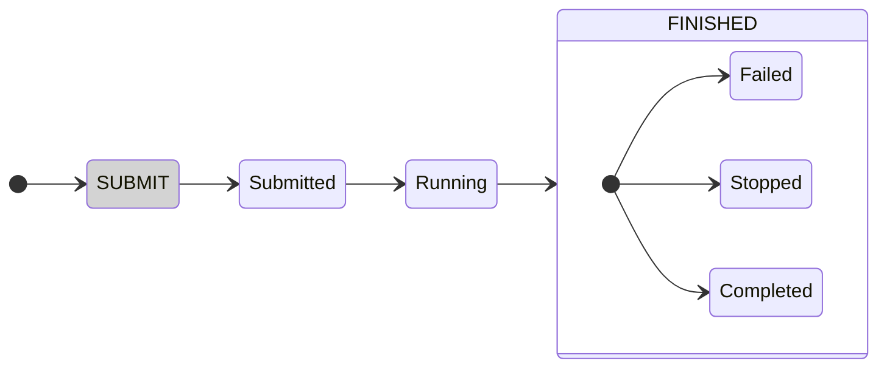

```@meta
CurrentModule = JuliaHub
DocTestSetup = :(using JuliaHub)
```
```@setup examples
using JuliaHub
```

# [Jobs](@id job-apis)

JuliaHub.jl provides various methods to inspect and interact jobs that [have been submitted to JuliaHub](@ref job-submission).
It is also possible to get access to job outputs programmatically.

## Job status states

A job will be in various "states" during its execution, and its current state can be inspected via the [`.status`] field.

The following diagram illustrates the possible states a job can be in, and how it moves between them during a job lifecycle.



!!! note "Refreshing a Job object"

    An instance of a [`Job`](@ref) object reflects the state of the job when the [`job`](@ref) function was called.
    If you want to inspect the current state of a job, you must first "refresh" the job object, which can simply be done with the help of the [`job`](@ref) function.

    ```julia
    job = JuliaHub.job(job)
    ```

## [Jobs with exposed ports](@id jobs-apis-expose-ports)

Some JuliaHub jobs may expose ports and can be communicated with from the outside over the network (e.g. [batch jobs that expose ports](@ref jobs-batch-expose-port)).

If the job exposes a port, it can be accessed at a dedicated hostname (see the `.hostname` property of the [`Job`](@ref) object).
The server running on the job is always exposed on port `443` on the public hostname, and the communication is TLS-wrapped (i.e. you need to connect to it over the HTTPS protocol).
In most cases, your requests to the job also need to be authenticated (see also the [`JuliaHub.request`](@ref) function).

See also: [the guide on submitting batch jobs with open ports](@ref jobs-batch-expose-port), [`expose` argument for `JuliaHub.submit_job`](@ref JuliaHub.submit_job), [`JuliaHub.request`](@ref)

## Reference

```@docs
JuliaHub.JobReference
JuliaHub.jobs
JuliaHub.job
JuliaHub.isdone
JuliaHub.wait_job
JuliaHub.kill_job
JuliaHub.extend_job
JuliaHub.JobLogMessage
JuliaHub.job_logs
JuliaHub.job_logs_buffered
JuliaHub.job_logs_older!
JuliaHub.job_logs_newer!
JuliaHub.AbstractJobLogsBuffer
JuliaHub.hasfirst
JuliaHub.haslast
JuliaHub.interrupt!
JuliaHub.job_files
JuliaHub.job_file
JuliaHub.download_job_file
JuliaHub.Job
JuliaHub.JobStatus
JuliaHub.JobFile
JuliaHub.FileHash
JuliaHub.request
```

## Index

```@index
Pages = ["jobs.md"]
```
